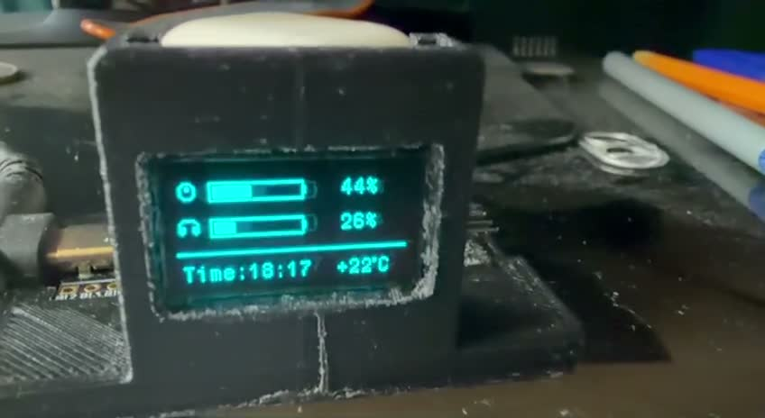

# STM32 USB Status Display

[Русский](README.md) · **English**

A desktop indicator built with **STM32F401CCU6** and a **128×64 SSD1306 OLED**. It receives data from a computer over USB CDC and displays mouse/headset battery levels, charging status, time and temperature.

[](media/demo.mp4)

[Watch the demo — 23 seconds, silent MP4](media/demo.mp4)

## Architecture

```text
PC data sources → Python application → USB CDC → STM32F401 → I2C → OLED
```

This repository contains the firmware and a [Python client with setup instructions](python/README.en.md). The client reads battery levels through HID, gets PC time and wttr.in temperature, and sends the six fields documented below. USB CDC provides a virtual COM port; the connection does not use a hardware UART.

## Features

- OLED connected through I2C1 configured at 400 kHz.
- Text reception through USB Device CDC.
- Line accumulation up to `\n`, ignoring `\r` and discarding overlong lines.
- Parsing six fields and displaying battery levels, charging status, time and temperature.
- Loading screen while waiting for data.

## My contribution

I connected the microcontroller and peripherals, configured the project in CubeMX and tested the device. The firmware and PC application were developed **with AI assistance**. The project combines microcontroller peripherals with data collection on a PC.

The project uses STM32 HAL, the ST USB Device Library and a third-party SSD1306 driver. I did not author the OLED driver; original attribution is preserved.

## Enclosure

I independently designed a 3D model of the OLED indicator enclosure in **SolidWorks** as part of a university project.

## Connections

| Component | Configuration |
|---|---|
| Microcontroller | STM32F401CCU6 |
| OLED | SSD1306, 128×64 |
| I2C SCL / SDA | PB6 / PB7 |
| USB D− / D+ | PA11 / PA12 |

This table reflects the firmware configuration. Exact board/OLED module models, power wiring and external pull resistors are not yet documented.

## Data format

Example matching the firmware parser:

```text
L75 LC0 A60 AC1 T14:30 W18
```

Append `\n` after the last field.

| Field | Meaning |
|---|---|
| `L` / `A` | Mouse / headset battery percentage |
| `LC` / `AC` | Charging: 1 = yes, 0 = no, −1 = unknown |
| `T` | Time string, such as `14:30` |
| `W` | Temperature, such as `18` |

Current display conventions use zero battery as `--%` and negative headset battery as `USE AUD HQ`. Input range validation is incomplete.

## Build

**Arm Compiler 6.22**, **Keil.STM32F4xx_DFP 3.1.1**. The `.ioc` specifies **STM32Cube FW_F4 V1.28.3**.

1. Clone the repository and preserve its directory structure.
2. Open `MDK-ARM/power.uvprojx` in Keil µVision with the compiler and device pack above.
3. Run **Rebuild**. CubeMX regeneration is not needed to build the saved project.

Outputs are written to `MDK-ARM/power/` and excluded from Git. The required dependency subset is included; regeneration or configuration changes require the corresponding CubeMX package.

## Code map

- `Core/Src/main.c`: field parsing and display rendering.
- `USB_DEVICE/App/usbd_cdc_if.c`: incoming line accumulation.
- `Core/Src/ssd1306.c`, `Core/Inc/ssd1306.h` and `fonts` files: third-party driver and fonts.
- `power.ioc`: peripheral configuration.
- `python/maxwell_battery.py`: PC data collection and USB CDC transmission.

## Demo and limitations

The video shows startup, the loading screen, then mouse battery at 44%, headset battery at 26%, time and temperature. The PC also shows 44% for a PRO X SUPERLIGHT 2.

- The Python client targets Audeze Maxwell and Logitech G PRO X Superlight 2. Setup and validation scope are documented in [python/README.en.md](python/README.en.md).
- The main loop and USB callback share a buffer and flag. Potential data loss or inconsistent reads under frequent messages have not been tested; `volatile` is not a replacement for synchronization.
- USB disconnects, malformed input and out-of-range values require further validation.

Build verification is recorded in [VALIDATION.md](VALIDATION.md).

## Related open-source contribution

While working with Audeze Maxwell, I reported an audio-balance change after battery polling and proposed an initialization fix in HeadsetControl, using AI assistance during the investigation. The PR description reports testing on the original Maxwell; Maxwell 2 was not hardware-tested.

- [Issue #561](https://github.com/Sapd/HeadsetControl/issues/561).
- [PR #577](https://github.com/Sapd/HeadsetControl/pull/577): open, not merged as of September 10, 2026.

## Components and attribution

Project author: [NOVA2270](https://github.com/NOVA2270). See [THIRD_PARTY_NOTICES.md](THIRD_PARTY_NOTICES.md). Original notices are preserved; the SSD1306 driver credits Tilen Majerle and Alexander Lutsai and specifies GPL v3 or later.
